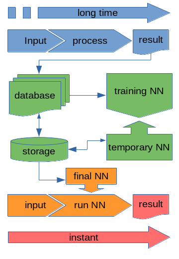
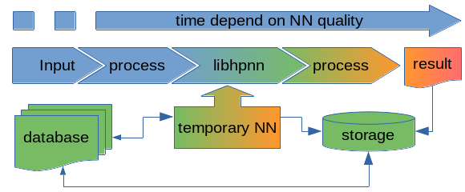
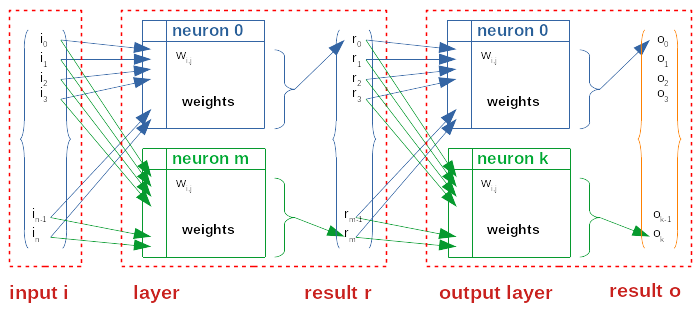

# hpnn
High performance neural networks

## Introduction

The hpnn library is an (academic) essay on trying to develop a simple, yet optimized, library for the "on-the-fly" training of artificial neural networks (ANNs).
The goal is to provide any given program an access to the creation, training, and use of ANN through a very simplistic API, creating ANNs as the program perform its regular calculations.

The novelty (or oddness) of our method is that the training of ANNs is aimed to be performed while the actual calculation are performed, for example, if we consider a normal ANN creation and optimization such as:

A database is build using the many output produced by running a program (in blue).
Then, an ANN is trained with the data from the database (in green).
When the training is deem good enough, a final ANN can be use (in orange) to produce a result (in red) from input almost instantly.
The quality of the output of course depend on the quality of the database.
Usually, the training process is quite long, and obtaining the database can be problematic: high quality database usually require a huge amount of time and/or some significant financial.
Note that in such "classic" scenario, the demonstration `train_nn` and `run_nn` programs from libhpnn can be used.

The goal libhpnn is trying to achieve can be viewed as:

In this case, an ANN in enriched on the fly each time the program is run.
As the ANN quality improved, the ANN can be used together with the program as a was to optimize its performance.
Of course, the ANN part has to be "corrected" by the program on each run until such correction prove unnecessary.
For example, if one consider using an ANN in place of a self consistent (iterative) calculation:
* at first the ANN is poorly optimized, the ANN part is then no better than a random initialization of the calculation, and the whole calculation should take a little _longer_ than it would without the ANN part.
* as the ANN improved, the iterative part will reduce, since the initialization will be a "better" guess (than a random one). In this part, the training and preparation of ANN will challenge the reduction of the iterative part.
* when the ANN is getting efficient, the iterative part will reduce significantly (ideally tending to a single iteration). At that point the training of ANN will also be reduce and can even be switched off. The remaining iterative part will then act as a "safety net" for the (still possible) failures of the ANN.

The HPNN library is developed "from scratch" (which means from accessible books and literature) and is provided _as is_ in the hope that it will be helpful (see [License](LICENSE)).

The library is written in plain C, and optimized for use in parallel systems with several layers:
* MPI - for the inter-nodes computations
* OpenMP - for the intra-nodes computations
* CUDA - for GPGPU computations

Some other technologies (for ex. openCL) may be added later.

This work is still at a very, very early stage!
Some _demonstration_ wrapper are provided which shows an example of integration with the library: these are not the programs you are looking for ;)
* train_nn: demonstrate how to train a network using MPI/OpenMP/CUDA, taking training set from a sample directory, and creating a kernel.opt file which contains the definition of the optimized ANN.
* run_nn: demonstrate how to run a specific ANN against a testing set from a test directory.

Additionally, in order to produce a valid set of input/output to feed an ANN, a tutorial presentation is available which will download an X-ray diffraction (XRD) database and create two programs to format it into a simple format. It consist in a script that will do most of the demonstration by itself. The full explanation of this tutorial is available here.
This tutorial is provided in order to understand libhpnn API, it is by no mean a guide of good practice in producing reasonable model for XRD predicting the geometry of a crystal using XRD pattern.
-> in case you are interested by such application, I recommend reading the following paper: 
P.M. Vecsei, K. Choo, J. Chang, and T. Neupert, Phys. Rev. B 99, 245120 (2019). A preprint is available [here](https://arxiv.org/abs/1812.05625)

## License 

* libhpnn is a free software: you can redistribute it and/or modify it under the terms of the GNU General Public License as published by the Free Software Foundation, either version 3 of the License, or (at your option) any later version.
* libhpnn is distributed in the hope that it will be useful, but WITHOUT ANY WARRANTY; without even the implied warranty of MERCHANTABILITY or FITNESS FOR A PARTICULAR PURPOSE.  See the GNU General Public [License](LICENSE) for more details.
* libhpnn should include a copy of the GNU General Public License.  If not, see <[https://www.gnu.org/licenses/](https://www.gnu.org/licenses/)>.

## Compile

Usually the `autogen.sh` script will find the best option for compiling libhpnn.
In such case, it will produce a `configure` executable, which can be run to prepare the Makefiles.
After that, given that no error is encountered, a `make all` command will compile the library and a `make install` will install it into the directory specified by the `--prefix=` option (which default to /usr/local on GNU/Linux). Depending on where the installation is performed, the latter installation could require elevated privilege (such as root).

Additionally, before the `make install` step, one may want to test the libhpnn library. The `make check` command will perform several tests, depending on the library capability. Should one of the test FAIL, please check external compilers and library (C compiler, MPI, openMP, CUDA) prior to filling a BUG report.

One may want to use specific compiler, libraries, or capabilities settings for the compilation of libhpnn. In such cases, please consult the [install](INSTALL) file.

## ANN types

Generally a ANN can be viewed as shown in the following scheme:

In which an array (ie a vector containing values i) is given as an input and pass to a layer. Such layer is composed of a vector (possibly of a different dimension than input) of neurons. A neurons is actually a matrix of weights to which the input vector will be multiplied, and an activation function which will be applied to the result of the multiplication. Such activation can be a simple logical operation (such as if result is positive function is 1 and 0 otherwise), or a more complex function - for ex. a sigmoid will offer more flexibility than a simple logical activation. That function result is the result of a layer and is an array of values (r in the figure). The operation can then be repeated several times by adding several layers. The last layer is called the output layer by convention because it contains the final output array (o values). Layers between input array and output layer are called hidden layers. Sometimes the input array is improperly called "input layer" even though it does not contain any relevant layer elements (roughly it would be as if it is multiplied by the identity matrix followed by a f(x)=x function). Layers are also sometimes modeled with an array of bias b values that are added to the result function, but its use is limited and it has been proven to be equivalent to adding an appropriate neuron, and therefore is not implemented in libhpnn.

This simple topology in which each layer output is the input of the next layer is called a feed-forward layer.

### Basic ANN (NN\_TYPE\_ANN)

The NN\_TYPE\_ANN (in which A stands for 'activated') is a simple feed-forward topology (see above) with:
* inputs: any number of inputs, which must be consistent with sample and test files, used for training and testing ANN, respectively;
* any number of hidden layers (at least 1), each of them composed of any number of neurons;
* an output layer, composed of a number of neurons equals to the number of outputs.

The activation is fixed for all layers (including the output layers) and is of sigmoid type.

Training methods allowed for NN\_TYPE\_ANN are:
- [x] simple back-propagation;
- [x] back-propagation with momentum;
- [ ] conjugate gradient method;
- [ ] simplex.

The NN\_TYPE\_ANN is optimized for:
- [x] Serial processing, using BLAS (lvl. 2);
- [x] openMP (multicore) processing, using parallel BLAS (openblas, intel mkl);
- [x] CUDA (multi-GPU) processing, using CUBLAS;
- [x] MPI multi-nodes (and multi CPUs), using OPENMPI (v. 4)
- [x] MPI/OpenMP combination (for multi-nodes/multi-CPUs/multi-cores configurations.
- [ ] MPI/CUDA for GPGPU capable multi-nodes (work in progress).

### Probabilistic results SNN (NN\_TYPE\_SNN)

The NN\_TYPE\_SNN (in which S stands for 'softmax') is also simple feed-forward topology (see above) which only differ from the NN\_TYPE\_ANN by the output layer.
In this ANN type, the output activation is determine by the softmax exponential activation function.

Activation function is of sigmoid type for all but output layers.

Incoming...

